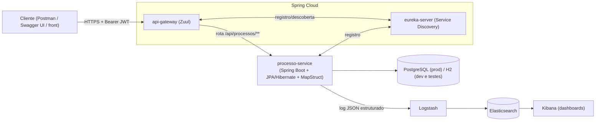

# 01 — Arquitetura Geral

## Visão de negócio (mínima, só para dar corpo ao código)

Um sistema que gerencia **Processos Judiciais**:

- `Processo` — agregado raiz (número, classe, vara, status, data de autuação).
- `Parte` — pessoa física/jurídica ligada a um processo (autor, réu).
- `Movimentacao` — entidade filha do agregado `Processo` (despacho, decisão, sentença — histórico imutável).

Isso é suficiente para exercitar relacionamento 1:N em JPA, DTOs distintos de entidade, regras de negócio
simples (ex.: não é possível adicionar movimentação em processo arquivado) e paginação/filtro em REST —
sem inventar um domínio de brinquedo tipo "Livraria" que não aparece em nenhum edital.

## Visão macro da arquitetura

## Os três módulos Maven (multi-module)

| Módulo | Papel | Empacotamento |
|---|---|---|
| `eureka-server` | Registro/descoberta de serviços — cada microsserviço se anuncia aqui ao subir, e o gateway consulta aqui "onde está o processo-service agora". | JAR (Spring Boot embutido) |
| `api-gateway` | Porta de entrada única. Roteia requisições para o serviço correto via Zuul, e é o lugar natural para validar o JWT **antes** de a requisição chegar no serviço de domínio (cross-cutting concern). | JAR (Spring Boot embutido) |
| `processo-service` | O microsserviço de domínio de fato: entidades JPA, regras de negócio, REST controllers, Swagger, segurança fina (`@PreAuthorize`), testes. | **WAR** — propositalmente, para você praticar deploy em Tomcat/JBoss/WildFly externos, além do JAR embutido padrão do Spring Boot |

## Por que microsserviços aqui (e não um monólito)?

Não é "porque é moda" — é porque o edital pede explicitamente Eureka e Zuul, que só fazem sentido existindo
em um cenário com **mais de um serviço**. Um monólito nunca precisaria de service discovery. Então o
`api-gateway` e o `eureka-server` são propositalmente enxutos (pouca lógica) para você focar o aprendizado
neles como *infraestrutura de plataforma*, enquanto toda a complexidade de domínio/JPA/testes fica
concentrada no `processo-service`, que é o módulo espelhado no Passo 2 com mais profundidade.

## Paralelo rápido com o que você já conhece

Se no .NET você já montou algo com **Ocelot/YARP** na frente de duas APIs registradas num service registry
(Consul/Steeltoe), a mentalidade é idêntica — client final nunca fala direto com `processo-service`, sempre
passa pelo gateway. O mapeamento detalhado peça-por-peça está em
[`04-mapeamento-dotnet-java.md`](04-mapeamento-dotnet-java.md).
