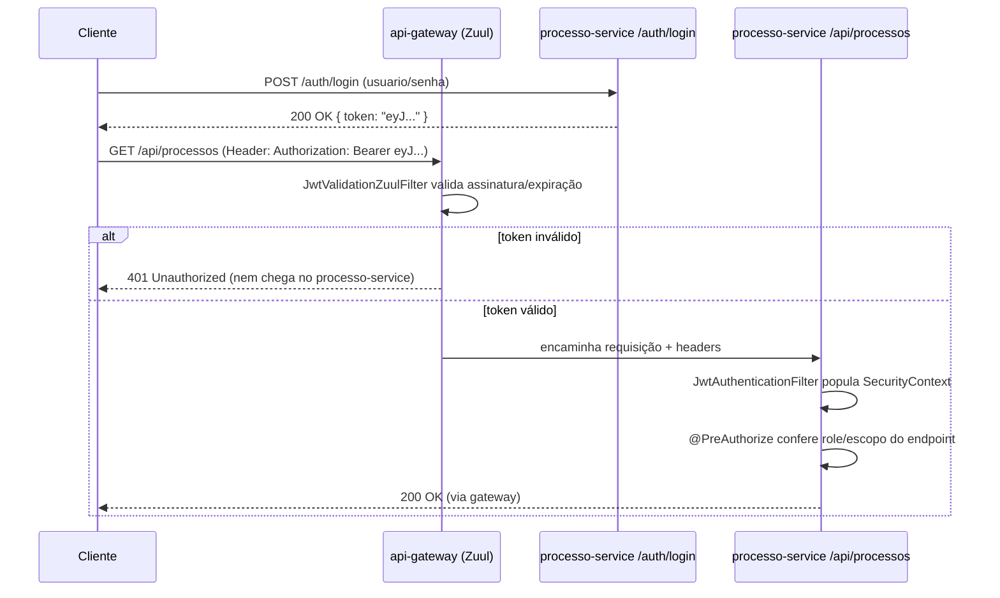

# 06 — Segurança (JWT) e Observabilidade (ELK)

## Fluxo JWT



Ponto chave: a validação acontece **duas vezes por camadas diferentes, com propósitos diferentes**:

1. **No gateway (Zuul filter)** — validação "grosseira": token existe? assinatura bate? não expirou?
   Rejeita cedo, sem nem acordar o `processo-service`. Equivalente a um middleware de autenticação global
   antes do roteamento, no .NET seria algo no próprio Ocelot/YARP pipeline.
2. **No `processo-service` (Spring Security)** — validação "fina": qual usuário é, quais roles/escopos tem,
   se pode acessar **este** endpoint específico (`@PreAuthorize("hasRole('ANALISTA')")`). Equivalente ao
   `[Authorize(Roles = "...")]` do ASP.NET Core, que também é decidido no nível de cada controller/ação, não
   no gateway.

## Onde cada peça mora

| Peça | Local | Papel |
|---|---|---|
| `AuthController` | `processo-service/controller` | Emite o JWT após validar credenciais |
| `JwtTokenProvider` | `processo-service/security` | Gera/assina e valida o token (biblioteca JJWT) |
| `JwtAuthenticationFilter` | `processo-service/security` | `OncePerRequestFilter` que roda em toda requisição, extrai o token do header e popula o `SecurityContext` |
| `JwtValidationZuulFilter` | `api-gateway/filter` | Zuul `pre` filter — barra requisição sem token válido antes de rotear |

## Observabilidade — por que ELK e não só `System.out.println`/`logger.info`

Em um cenário de microsserviços, uma requisição do cliente pode atravessar `api-gateway` →
`processo-service`. Sem log centralizado, debugar significa abrir dois consoles diferentes e tentar casar
timestamps manualmente — inviável em produção.

### Pipeline planejado

```
processo-service (Logback) --JSON estruturado--> Logstash --parse/index--> Elasticsearch --consulta--> Kibana
```

- **Logback** — implementação de log padrão do Spring Boot (equivalente ao `Microsoft.Extensions.Logging`
  com provider). Configurado em `logback-spring.xml`.
- **`logstash-logback-encoder`** — biblioteca que formata cada linha de log como **JSON estruturado**
  (campos: timestamp, nível, logger, mensagem, MDC) em vez de texto plano — assim o Elasticsearch consegue
  indexar campos individualmente (filtrar por `nivel=ERROR`, por exemplo), não só full-text.
- **MDC (Mapped Diagnostic Context)** — mecanismo do SLF4J para anexar contexto (ex.: `requestId`,
  `usuarioId`) a toda linha de log dentro do mesmo request/thread. Equivalente direto: `ILogger` scopes
  (`_logger.BeginScope(...)`) ou enrichers do Serilog no .NET — mesmíssima ideia, nome diferente.
- **Logstash** — recebe/processa os logs (poderia também vir direto do Filebeat lendo arquivo; no nosso
  caso o encoder já entrega JSON, então o pipeline do Logstash fica simples).
- **Elasticsearch** — armazena e indexa.
- **Kibana** — dashboards e busca sobre os dados indexados.

### O que o código vai preparar (Passo 2) vs o que fica como exercício de infra

O `processo-service` vai sair **pronto** para ELK: `logback-spring.xml` já formatando JSON e com um
appender TCP apontando para `localhost:5000` (porta padrão de um Logstash local). Subir o stack ELK em si
(via `docker-compose`) é opcional e fica registrado no roadmap como uma fase à parte, já que depende de
Docker rodando na sua máquina e não é código Java.
